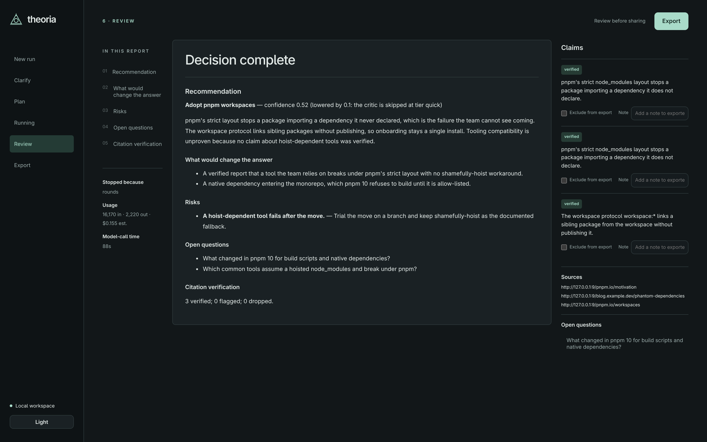

# Theoria for Omarchy



One bar icon and one panel for Theoria, a local research and decision
app: what the current run is doing and what it has spent, a box to start a run from a brief, the five most recent
runs, and a button that opens the app window.

## Requirements

- Omarchy with `omarchy-shell` and `omarchy-launch-webapp`
- Arch's `nodejs` package (Node 24 or newer at `/usr/bin/node`), `npm`, and `curl`
- The Theoria version pinned in `engine/package.json`, installed from this plugin's committed lockfile into your home directory:

  ```sh
  mkdir -p ~/.local/share/theoria/engine
  cp ~/.config/omarchy/plugins/io.github.broken-branch.theoria/engine/package.json ~/.config/omarchy/plugins/io.github.broken-branch.theoria/engine/package-lock.json ~/.local/share/theoria/engine/
  npm ci --prefix ~/.local/share/theoria/engine --ignore-scripts
  ~/.local/share/theoria/engine/node_modules/.bin/theoria doctor
  ```

  Theoria is MIT licensed; the installed dependency tree is about 290 MB. A shell `theoria` command is optional:
  you can symlink it to `~/.local/share/theoria/engine/node_modules/.bin/theoria`. The panel always starts the
  private engine and never runs a `theoria` found on your shell path. Keep `node_modules` outside the plugin folder;
  Omarchy plugin validation refuses symlinks there. Theoria runs on a Claude, ChatGPT or Google subscription, an
  OpenAI-compatible endpoint such as OpenRouter, or a local model under Ollama or llama.cpp.

An engine started by the panel has `PATH=/usr/local/bin:/usr/bin:/bin`. The `codex` and `gemini` providers need
their CLIs in one of those directories; otherwise start Theoria from a shell.

## Install as an Omarchy plugin

```sh
omarchy plugin add https://github.com/broken-branch/omarchy-theoria.git
omarchy plugin enable io.github.broken-branch.theoria
```

A plugin lands disabled so you can read its code before enabling it. Put the widget where you want it with
`omarchy bar move io.github.broken-branch.theoria`.

To remove it:

```sh
omarchy plugin disable io.github.broken-branch.theoria
omarchy plugin remove io.github.broken-branch.theoria
```

Disabling takes the icon off the bar; removing deletes the plugin folder. Neither touches Theoria, its settings or
its runs.

## Panel

The bar always shows the Theoria mark. During a run it adds the stage and the tokens spent — "Researching · 118k" —
or **Needs you** when the run is waiting for an answer. Click the icon for the panel, right-click to open the app.

The panel shows the current run's brief, stage, budget meter, estimated spend and elapsed time; a brief box that
opens Theoria's New run screen with your text filled in; the five most recent runs, each opening its own screen;
and **Open Theoria**. When no server is running, the panel says so and Open starts one. If the pinned
Theoria version is missing or another version is installed, the panel shows setup commands for this plugin's
location, a **Copy** button, and a link to the setup steps. It returns to the normal view after the pinned
version is installed.

Theoria runs one thing at a time, so the brief box is disabled while a run is going.

## Settings

`refreshIntervalSec` (default 5) is how often the panel asks the running engine for its status. It polls once a
minute while the engine is idle, and not at all when no engine is running.

## What it reads and runs

It watches `~/.local/share/theoria/server.json`, which the engine writes, and reads `GET /api/status` from the
loopback address and token in that file. To open the app, it asks the engine for a one-time link (`POST /api/open`)
and passes that link to `omarchy-launch-webapp`; the token reaches `curl` on stdin, not in process arguments.
**Setup steps** opens this plugin's [GitHub README](https://github.com/broken-branch/omarchy-theoria#readme)
through the same launcher. To start the engine,
it reads `~/.local/share/theoria/engine/node_modules/theoria/package.json` and runs
`~/.local/share/theoria/engine/node_modules/theoria/dist/cli/main.js` through `node` only when the package matches the Theoria version pinned in `engine/package.json`. The engine
is detached from the panel. `node`, `curl` and the webapp launcher are resolved from
`/usr/local/bin:/usr/bin:/bin` and run with a minimal environment. It holds no key, stores nothing and sends
its status and open API requests only to the loopback engine. Opening Setup steps visits GitHub in the browser.

## Development

`./check` is the whole gate: the required files exist, the manifest is valid, `qmllint` accepts every QML file when
Qt's tools are installed, and the unit tests of `status.js` pass. `status.js` holds every formatting and URL
decision so it can be proven without Qt; QML holds layout and process wiring only. See
[CONTRIBUTING.md](CONTRIBUTING.md).

## License

MIT — see [LICENSE](LICENSE).
